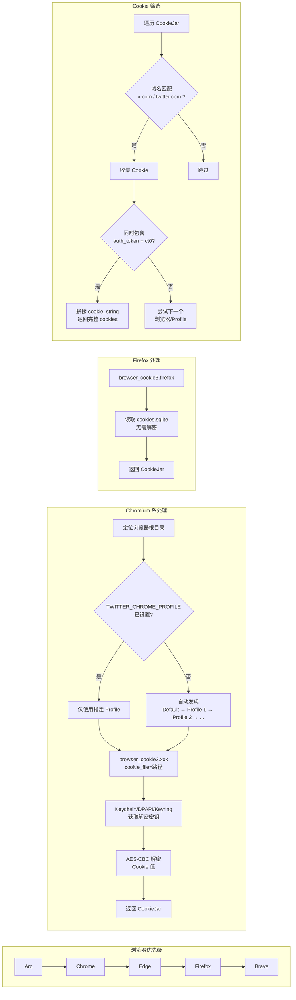
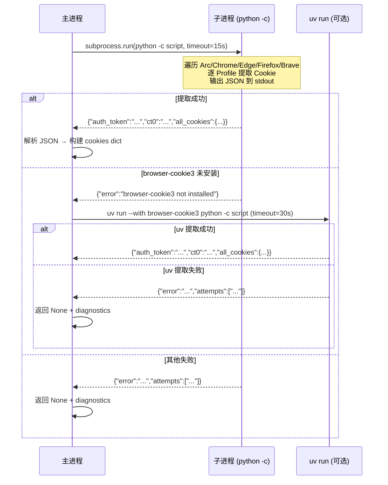

# Twitter Cookie 自动提取：设计与实现文档

## 概述

`extract_from_browser()` 是 twitter-cli 的核心认证函数，负责**从用户本地浏览器中自动提取 Twitter/X 的认证 Cookie**，使 CLI 工具无需用户手动复制粘贴 Cookie 即可完成认证。

整个系统围绕一个核心思路：**浏览器在本地磁盘以 SQLite 数据库的形式存储 Cookie，读取并解密这些数据库文件即可获取认证信息。**

---

## 依赖工具

| 工具 / 库 | 用途 | 说明 |
|---|---|---|
| **browser-cookie3** | Cookie 读取与解密 | Python 库，支持从 Chrome/Firefox/Edge/Brave/Arc 等浏览器读取 Cookie |
| **SQLite** | Cookie 存储格式 | 所有主流浏览器都使用 SQLite 数据库存储 Cookie |
| **macOS Keychain** | Cookie 解密密钥存储 | Chromium 浏览器在 macOS 上使用 Keychain 存储 AES 加密密钥 |
| **gnome-keyring / SecretStorage** | Cookie 解密密钥存储（Linux） | Linux 上 Chromium 使用系统 keyring 存储加密密钥 |
| **subprocess** | 子进程执行 | 用于 fallback 方案，在独立进程中提取 Cookie |
| **uv** | Python 包管理器（可选） | 当环境中未安装 browser-cookie3 时，通过 uv 临时安装并运行 |
| **curl_cffi** | Cookie 验证 | 通过模拟浏览器 TLS 指纹向 Twitter API 发送验证请求 |

---

## 浏览器 Cookie 存储原理

### Chromium 系（Chrome / Arc / Edge / Brave）

Cookie 存储为 **加密的 SQLite 数据库文件**，位于各 profile 目录下的 `Cookies` 文件中。

**各平台路径：**

| 平台 | 路径格式 |
|---|---|
| macOS | `~/Library/Application Support/<BrowserDir>/<Profile>/Cookies` |
| Windows | `%LOCALAPPDATA%/<BrowserDir>/User Data/<Profile>/Cookies` |
| Linux | `~/.config/<BrowserDir>/<Profile>/Cookies` |

**各浏览器的 `<BrowserDir>` 映射：**

```python
_CHROMIUM_BASE_DIRS = {
    "chrome": "Google/Chrome",
    "arc":    "Arc/User Data",
    "edge":   "Microsoft Edge",
    "brave":  "BraveSoftware/Brave-Browser",
}
```

**加密方式：**

- macOS：使用 AES-CBC，密钥存储在 **系统 Keychain** 的 `<Browser> Safe Storage` 条目中
- Linux：使用 AES-CBC，密钥存储在 **gnome-keyring / SecretStorage** 中
- Windows：使用 DPAPI（Data Protection API）

### Firefox

Cookie 存储为 **未加密的 SQLite 数据库**（`cookies.sqlite`），位于 Firefox profile 目录下。无需解密步骤。

---

## 提取的关键 Cookie

Twitter API 认证需要以下 Cookie：

| Cookie 名 | 作用 | 必需 |
|---|---|---|
| `auth_token` | 用户身份令牌，标识登录用户 | 是 |
| `ct0` | CSRF Token，用于防止跨站请求伪造 | 是 |
| 其他 Twitter Cookie | 构成完整的浏览器指纹，降低被风控的概率 | 否（但推荐） |

函数会提取**所有** Twitter 域名下的 Cookie，拼接为完整的 `cookie_string`，模拟真实浏览器的 Cookie 指纹。

---

## Mermaid 流程图

### 完整认证流程

```mermaid
flowchart TD
    START([用户执行 CLI 命令]) --> GET[get_cookies]

    GET --> ENV{检查环境变量<br/>TWITTER_AUTH_TOKEN<br/>+ TWITTER_CT0}
    ENV -->|都存在| VERIFY
    ENV -->|缺失| BROWSER[extract_from_browser]

    BROWSER --> INPROC[策略 1: _extract_in_process<br/>主进程内提取]

    INPROC --> BC3{browser-cookie3<br/>已安装?}
    BC3 -->|否| INPROC_FAIL
    BC3 -->|是| LOOP[/遍历浏览器<br/>Arc → Chrome → Edge<br/>→ Firefox → Brave/]

    LOOP --> IS_CHROMIUM{Chromium 系?}

    IS_CHROMIUM -->|是| PROFILES[_iter_chrome_cookie_files<br/>发现所有 Profile]
    IS_CHROMIUM -->|否| FF_LOAD[browser_cookie3.firefox<br/>读取 cookies.sqlite]

    PROFILES --> HAS_PROFILES{找到<br/>Profile 文件?}
    HAS_PROFILES -->|是| ITER_PROFILE[逐个 Profile 调用<br/>browser_cookie3.xxx<br/>cookie_file=path]
    HAS_PROFILES -->|否| DEFAULT_CALL[browser_cookie3.xxx<br/>无参数默认调用]

    ITER_PROFILE --> DECRYPT[browser_cookie3 内部:<br/>1. 读取 SQLite<br/>2. 获取 Keychain 密钥<br/>3. AES-CBC 解密]
    DEFAULT_CALL --> DECRYPT
    FF_LOAD --> JAR_EXTRACT

    DECRYPT --> JAR_EXTRACT[_extract_cookies_from_jar]
    JAR_EXTRACT --> FILTER{过滤 Twitter 域名<br/>x.com / twitter.com}

    FILTER --> HAS_AUTH{包含<br/>auth_token + ct0?}
    HAS_AUTH -->|是| BUILD_COOKIE[构建 cookies dict<br/>+ 完整 cookie_string]
    HAS_AUTH -->|否| NEXT_BROWSER{还有下一个<br/>浏览器/Profile?}

    NEXT_BROWSER -->|是| LOOP
    NEXT_BROWSER -->|否| INPROC_FAIL[进程内提取失败]

    BUILD_COOKIE --> VERIFY

    INPROC_FAIL --> SUBPROCESS[策略 2: _extract_via_subprocess<br/>子进程降级提取]

    SUBPROCESS --> RUN1[subprocess.run<br/>python -c extract_script<br/>timeout=15s]

    RUN1 --> RUN1_OK{成功?}
    RUN1_OK -->|是| PARSE_JSON[解析 stdout JSON]
    RUN1_OK -->|否| NEED_UV{失败原因:<br/>browser-cookie3<br/>未安装?}

    NEED_UV -->|是| RUN2[uv run --with browser-cookie3<br/>python -c extract_script<br/>timeout=30s]
    NEED_UV -->|否| FAIL

    RUN2 --> RUN2_OK{成功?}
    RUN2_OK -->|是| PARSE_JSON
    RUN2_OK -->|否| FAIL

    PARSE_JSON --> VERIFY

    VERIFY[verify_cookies<br/>调用 Twitter API 验证]
    VERIFY --> VERIFY_RESULT{HTTP 状态码}

    VERIFY_RESULT -->|200| SUCCESS([认证成功<br/>返回 cookies])
    VERIFY_RESULT -->|401 / 403| RETRY{重新提取<br/>extract_from_browser}
    VERIFY_RESULT -->|其他错误| SUCCESS

    RETRY --> RETRY_OK{重新提取成功?}
    RETRY_OK -->|是| VERIFY2[再次 verify_cookies]
    RETRY_OK -->|否| FAIL

    VERIFY2 --> VERIFY2_RESULT{验证结果}
    VERIFY2_RESULT -->|通过| SUCCESS
    VERIFY2_RESULT -->|失败| FAIL

    FAIL([认证失败<br/>RuntimeError + 诊断信息]) --> DIAGNOSE[_diagnose_keychain_issues]
    DIAGNOSE --> HINT[/输出修复建议:<br/>Keychain 授权 / 环境变量<br/>/ twitter doctor/]

    style START fill:#4CAF50,color:#fff
    style SUCCESS fill:#4CAF50,color:#fff
    style FAIL fill:#f44336,color:#fff
    style INPROC fill:#2196F3,color:#fff
    style SUBPROCESS fill:#FF9800,color:#fff
    style VERIFY fill:#9C27B0,color:#fff
```



### 进程内提取 — 浏览器遍历细节



### 子进程降级 — 执行与通信



---

## 整体流程

### 顶层入口：`get_cookies()`

```
┌─────────────────────────────────────────────────────────────┐
│                      get_cookies()                          │
│                                                             │
│  1. load_from_env()                                         │
│     ├─ 检查 TWITTER_AUTH_TOKEN + TWITTER_CT0 环境变量        │
│     └─ 如果都存在 → 直接返回                                 │
│                                                             │
│  2. extract_from_browser()   ← 本文重点                      │
│     └─ 从本地浏览器自动提取                                   │
│                                                             │
│  3. verify_cookies()                                         │
│     ├─ 调用 Twitter API 验证 Cookie 有效性                    │
│     ├─ 401/403 → 认为 Cookie 过期，重新提取                   │
│     └─ 其他错误 → 容忍，延迟到首次 API 调用时验证              │
│                                                             │
│  4. 无 Cookie → 抛出 RuntimeError + 诊断信息                  │
└─────────────────────────────────────────────────────────────┘
```

### 核心函数：`extract_from_browser()`

```
┌──────────────────────────────────────────────────────────────────┐
│                    extract_from_browser()                         │
│                                                                  │
│  策略 1: _extract_in_process()  ── 主进程内提取                    │
│  │  ✓ macOS Keychain 授权可用                                     │
│  │  ✗ 浏览器运行时可能遇到 SQLite 数据库锁                         │
│  │                                                                │
│  │  成功 → 返回 cookies                                           │
│  │  失败 ↓                                                        │
│  │                                                                │
│  策略 2: _extract_via_subprocess()  ── 子进程提取（降级方案）       │
│     ✓ 可绕过 SQLite 锁（独立进程有独立的文件句柄）                  │
│     ✗ macOS 上子进程无法继承 Keychain 授权                          │
│                                                                   │
│     成功 → 返回 cookies                                            │
│     失败 → 返回 None + 诊断信息                                    │
└──────────────────────────────────────────────────────────────────┘
```

---

## 策略 1：进程内提取 `_extract_in_process()`

### 为什么需要"进程内"

macOS 上，Chromium 浏览器的 Cookie 加密密钥存储在系统 Keychain 中。Keychain 的安全模型要求：**访问密钥的进程必须获得用户授权**。子进程不会继承父进程的 Keychain 授权，因此必须在主进程中执行 `browser_cookie3`。

### 流程

```
_extract_in_process()
│
├─ import browser_cookie3（未安装则返回 None）
│
├─ 定义浏览器列表（按优先级）:
│   Arc → Chrome → Edge → Firefox → Brave
│
└─ 遍历每个浏览器:
    │
    ├─ [Chromium 系]
    │   │
    │   ├─ _iter_chrome_cookie_files(name)
    │   │   ├─ 检查 TWITTER_CHROME_PROFILE 环境变量
    │   │   │   └─ 设置了 → 只返回该 profile 的 Cookies 文件
    │   │   └─ 未设置 → 自动发现所有 profile
    │   │       ├─ Default/Cookies
    │   │       └─ Profile 1/Cookies, Profile 2/Cookies, ...
    │   │
    │   ├─ 无 profile 文件 → browser_cookie3.chrome() (无参数调用)
    │   └─ 有 profile 文件 → 逐个调用 browser_cookie3.chrome(cookie_file=path)
    │       │
    │       ├─ browser_cookie3 内部:
    │       │   1. 打开 SQLite 数据库
    │       │   2. 从 Keychain 获取解密密钥
    │       │   3. 解密 Cookie 值
    │       │   4. 返回 http.cookiejar.CookieJar
    │       │
    │       └─ _extract_cookies_from_jar(jar)
    │           ├─ 过滤 Twitter 域名的 Cookie
    │           ├─ 提取 auth_token + ct0
    │           ├─ 收集所有 Twitter Cookie → cookie_string
    │           └─ 返回 cookies dict 或 None
    │
    └─ [Firefox]
        └─ browser_cookie3.firefox() → 同上流程（无需解密）
```

### 核心代码

多浏览器多 Profile 遍历逻辑：

```python
browsers = [
    ("arc", browser_cookie3.arc),
    ("chrome", browser_cookie3.chrome),
    ("edge", browser_cookie3.edge),
    ("firefox", browser_cookie3.firefox),
    ("brave", browser_cookie3.brave),
]

for name, fn in browsers:
    if name in _CHROMIUM_BASE_DIRS:
        cookie_files = _iter_chrome_cookie_files(name)
        for cookie_file in cookie_files:
            jar = fn(cookie_file=cookie_file)
            cookies = _extract_cookies_from_jar(jar)
            if cookies:
                return cookies, diagnostics
    else:
        jar = fn()
        cookies = _extract_cookies_from_jar(jar)
        if cookies:
            return cookies, diagnostics
```

Cookie 筛选与提取逻辑：

```python
def _extract_cookies_from_jar(jar, source="unknown"):
    result = {}
    all_cookies = {}
    for cookie in jar:
        domain = cookie.domain or ""
        if _is_twitter_domain(domain):
            if cookie.name == "auth_token":
                result["auth_token"] = cookie.value
            elif cookie.name == "ct0":
                result["ct0"] = cookie.value
            if cookie.name and cookie.value:
                all_cookies[cookie.name] = cookie.value
    if "auth_token" in result and "ct0" in result:
        cookies = {"auth_token": result["auth_token"], "ct0": result["ct0"]}
        if all_cookies:
            cookies["cookie_string"] = "; ".join(
                "%s=%s" % (k, v) for k, v in all_cookies.items()
            )
        return cookies
    return None
```

---

## 策略 2：子进程提取 `_extract_via_subprocess()`

### 为什么需要子进程

当浏览器正在运行时，它会持有 `Cookies` SQLite 数据库的文件锁。主进程内的 `browser_cookie3` 可能因为锁冲突而失败。子进程通过独立的文件句柄可以绕过某些锁定场景。

### 流程

```
_extract_via_subprocess()
│
├─ 构造一个自包含的 Python 脚本字符串 (extract_script)
│   该脚本包含完整的浏览器遍历 + Cookie 提取逻辑
│   输出为 JSON（成功时包含 cookies，失败时包含 error + attempts）
│
├─ 第一次尝试: 使用当前 Python 环境
│   cmd = [sys.executable, "-c", extract_script]
│   timeout = 15 秒
│   │
│   ├─ 成功 → 解析 JSON → 返回 cookies
│   ├─ 失败（browser-cookie3 未安装）→ 尝试 uv fallback
│   └─ 失败（其他原因）→ 返回 None
│
└─ 第二次尝试（可选）: 使用 uv 临时安装 browser-cookie3
    cmd = ["uv", "run", "--with", "browser-cookie3", "python", "-c", extract_script]
    timeout = 30 秒
    │
    ├─ 成功 → 解析 JSON → 返回 cookies
    └─ 失败 → 返回 None
```

### 子进程通信协议

子进程通过 **stdout JSON** 与主进程通信：

**成功输出：**

```json
{
  "auth_token": "xxx",
  "ct0": "yyy",
  "browser": "chrome",
  "profile": "Default",
  "all_cookies": {
    "auth_token": "xxx",
    "ct0": "yyy",
    "guest_id": "...",
    "...": "..."
  }
}
```

**失败输出：**

```json
{
  "error": "No Twitter cookies found in any browser.",
  "attempts": [
    "arc[Default]=no-cookies",
    "chrome[Default]=PermissionError: ..."
  ]
}
```

---

## Cookie 域名匹配

Twitter 在迁移到 x.com 后，Cookie 可能存储在多个域名下：

```python
_TWITTER_DOMAINS = {"x.com", "twitter.com", ".x.com", ".twitter.com"}

def _is_twitter_domain(domain: str) -> bool:
    return (
        domain in _TWITTER_DOMAINS
        or domain.endswith(".x.com")
        or domain.endswith(".twitter.com")
    )
```

---

## 错误诊断系统

所有提取尝试的失败信息都会被收集到 `diagnostics` 列表中，供上层函数生成用户友好的错误提示。

### Keychain 诊断

当检测到诊断信息中包含 Keychain 相关关键词时，根据平台和环境给出针对性修复建议：

```
关键词检测: "key for cookie decryption" / "safe storage" / "keychain" / "secretstorage"
│
├─ macOS + SSH 会话
│   → "security unlock-keychain ~/Library/Keychains/login.keychain-db"
│
├─ macOS + 本地终端
│   → "Keychain Access → <Browser> Safe Storage → Access Control → 添加终端应用"
│
└─ Linux
    → "确保 keyring daemon 已解锁"
```

---

## Cookie 验证流程

提取到 Cookie 后，`get_cookies()` 会通过 `verify_cookies()` 验证其有效性：

```
verify_cookies(auth_token, ct0, cookie_string)
│
├─ 构造请求头:
│   Authorization: Bearer <BEARER_TOKEN>
│   Cookie: <完整 cookie_string 或最小集>
│   X-Csrf-Token: <ct0>
│   X-Twitter-Auth-Type: OAuth2Session
│
├─ 依次尝试以下端点:
│   1. https://api.x.com/1.1/account/verify_credentials.json
│   2. https://x.com/i/api/1.1/account/settings.json
│
├─ HTTP 200 → 验证成功，返回 screen_name
├─ HTTP 401/403 → Cookie 过期，抛出 RuntimeError
│   └─ 上层捕获后会重新 extract_from_browser() 再验证一次
└─ 其他错误 → 跳过验证，延迟到首次 API 调用时检查
```

---

## 完整数据流图

```
用户执行 CLI 命令
        │
        ▼
   get_cookies()
        │
        ├─ 1. 检查环境变量 ──── 有 → 直接使用
        │
        ├─ 2. extract_from_browser()
        │      │
        │      ├─ _extract_in_process()
        │      │   │
        │      │   ├─ browser_cookie3.arc(cookie_file=...)
        │      │   │       │
        │      │   │       ├─ 打开 SQLite (~/Library/.../Arc/User Data/Default/Cookies)
        │      │   │       ├─ 读取 Keychain 密钥 (Arc Safe Storage)
        │      │   │       ├─ AES-CBC 解密 Cookie 值
        │      │   │       └─ 返回 CookieJar
        │      │   │
        │      │   ├─ browser_cookie3.chrome(cookie_file=...)  [同上]
        │      │   ├─ browser_cookie3.edge(cookie_file=...)    [同上]
        │      │   ├─ browser_cookie3.firefox()
        │      │   │       └─ 读取 cookies.sqlite（无需解密）
        │      │   └─ browser_cookie3.brave(cookie_file=...)   [同上]
        │      │
        │      │   每个浏览器返回的 CookieJar:
        │      │   └─ _extract_cookies_from_jar()
        │      │       ├─ 过滤 x.com / twitter.com 域名
        │      │       ├─ 提取 auth_token + ct0（必需）
        │      │       └─ 收集所有 Twitter Cookie → cookie_string
        │      │
        │      │   成功 → 返回 cookies
        │      │   全部失败 ↓
        │      │
        │      └─ _extract_via_subprocess()
        │          │
        │          ├─ python -c "<内嵌脚本>"   (15s 超时)
        │          │   └─ 输出 JSON 到 stdout
        │          │
        │          ├─ 失败且缺少 browser-cookie3:
        │          │   └─ uv run --with browser-cookie3 python -c "<脚本>"  (30s 超时)
        │          │
        │          └─ 解析 JSON → 返回 cookies 或 None
        │
        ├─ 3. verify_cookies()
        │      ├─ 200 → 通过
        │      ├─ 401/403 → 重新 extract_from_browser() + 再验证
        │      └─ 其他 → 容忍，延迟验证
        │
        └─ 4. 无 Cookie → RuntimeError
               └─ 附带 Keychain 诊断信息
                   └─ 提示用户: 设置环境变量 或 登录浏览器 或 运行 twitter doctor
```

---

## 环境变量

| 环境变量 | 作用 | 默认值 |
|---|---|---|
| `TWITTER_AUTH_TOKEN` | 手动指定 auth_token Cookie | 无 |
| `TWITTER_CT0` | 手动指定 ct0 Cookie | 无 |
| `TWITTER_CHROME_PROFILE` | 指定 Chromium 浏览器 profile 名称 | 无（自动遍历所有 profile） |
| `SSH_CLIENT` / `SSH_TTY` / `SSH_CONNECTION` | 检测是否为 SSH 会话（影响诊断提示） | 由系统设置 |

---

## 设计权衡与决策

### 为什么优先进程内提取？

macOS Keychain 是最常见的使用场景，而 Keychain 授权**不可跨进程继承**。进程内提取是唯一能在 macOS 上正确解密 Cookie 的方式。

### 为什么需要子进程降级？

浏览器运行时会持有 SQLite 文件锁。子进程通过独立的文件描述符有时可以绕过锁定。此外，当主环境缺少 `browser-cookie3` 时，子进程方案可以通过 `uv` 临时安装依赖。

### 为什么收集所有 Cookie 而不仅是 auth_token + ct0？

仅发送两个 Cookie 容易触发 Twitter 的风控系统。发送完整的 Cookie 集合可以更好地**模拟真实浏览器指纹**，降低被限流或封禁的风险。

### 为什么支持多 Profile？

用户可能在不同的 Chrome Profile 中登录不同的 Twitter 账号。自动遍历所有 Profile 确保不会遗漏，同时 `TWITTER_CHROME_PROFILE` 环境变量允许用户精确指定。
